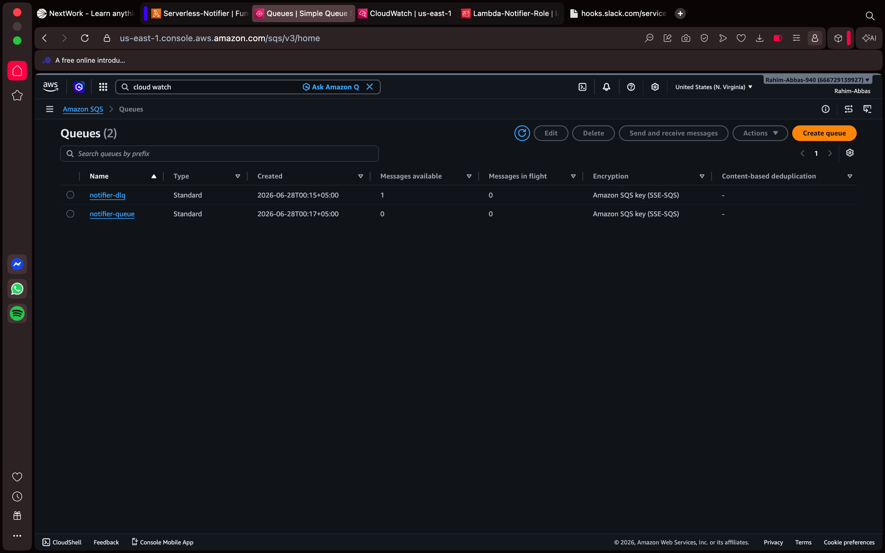
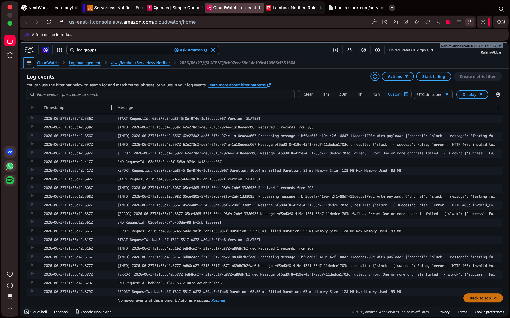

# Serverless Notification System

A production-ready serverless notification system built with Python and deployed on AWS Lambda. Sends alerts via **Email (AWS SES)** and **Slack** triggered by HTTP webhooks, with automatic retry logic and a Dead Letter Queue for fault tolerance.

---

## Architecture

```
HTTP POST Request
      │
      ▼
 API Gateway
      │
      ▼
AWS Lambda (Python 3.12)
      │
      ├──── Validator ────► Reject bad payloads (400)
      │
      └──── Router
              │
              ├──── AWS SES ────► Email ✓
              │
              └──── Slack Webhook ────► Slack Channel ✓
                          │
                     (if fails)
                          │
                          ▼
                   SQS notifier-queue
                          │
                    (retry up to 3x)
                          │
                     (still fails)
                          │
                          ▼
                   SQS notifier-dlq
                  (stored for inspection)
                          │
                          ▼
                   Dashboard UI ────► Replay button
```

---

## Features

- **Multi-channel notifications** — send to Email, Slack, or both simultaneously from a single request
- **Alert levels** — `info`, `warning`, `error`, `critical` with distinct colors and emojis per channel
- **Payload validation** — rejects malformed requests before touching any notification service
- **Per-channel fault isolation** — if one channel fails, others still fire
- **Automatic retry with SQS** — failed notifications queued and retried up to 3 times automatically
- **Dead Letter Queue** — messages that fail all 3 retries stored for manual inspection and replay
- **CloudWatch logging** — every invocation logged with payload and result
- **Styled HTML emails** — color-coded headers based on alert level
- **Slack Block Kit messages** — structured alerts with emoji badges
- **React dashboard** — send notifications, view logs, and replay DLQ messages from a UI

---

## Tech Stack

| Layer | Technology |
|---|---|
| Runtime | Python 3.12 |
| Compute | AWS Lambda |
| Email | AWS SES (Simple Email Service) |
| Messaging | Slack Incoming Webhooks |
| HTTP Trigger | AWS API Gateway (HTTP API) |
| Retry Queue | AWS SQS (Simple Queue Service) |
| Dead Letter Queue | AWS SQS DLQ |
| Logging | AWS CloudWatch |
| Dashboard | React + Vite + TypeScript |

---

## Screenshots

### Lambda Function + API Gateway Trigger


### CloudWatch Logs


### Slack Notifications


### SQS & DLQ Queue


### CloudWatch Logs for Queue


---

## Project Structure

```
serverless-notifier/
├── src/
│   ├── __init__.py
│   ├── handler.py              # Lambda entry point + path router
│   ├── sqs_handler.py          # SQS retry handler with batch failure support
│   ├── validators.py           # Payload validation
│   ├── router.py               # Channel dispatcher
│   ├── api/
│   │   ├── __init__.py
│   │   ├── logs_handler.py     # CloudWatch logs endpoint
│   │   └── dlq_handler.py      # DLQ read + replay endpoints
│   └── notifiers/
│       ├── __init__.py
│       ├── email_notifier.py   # AWS SES integration
│       └── slack_notifier.py   # Slack webhook integration
├── tests/
├── .env                        # Local environment variables (never commit)
├── .gitignore
└── README.md
```

---

## Prerequisites

- AWS account (free tier works)
- Python 3.12
- AWS CLI configured (`aws configure`)
- Slack workspace with Incoming Webhooks enabled
- Verified sender email in AWS SES

---

## Setup

### 1. Clone the repo

```bash
git clone https://github.com/RahimAbbas55/Serverless-Notification-System.git
cd Serverless-Notification-System
```

### 2. Install dependencies

```bash
pip install boto3 pytest pytest-mock
```

### 3. Configure environment variables

Create a `.env` file in the project root:

```bash
SES_SENDER_EMAIL=your-verified-email@gmail.com
SLACK_WEBHOOK_URL=https://hooks.slack.com/services/YOUR/WEBHOOK/URL
SQS_QUEUE_URL=https://sqs.us-east-1.amazonaws.com/YOUR_ACCOUNT_ID/notifier-queue
DLQ_URL=https://sqs.us-east-1.amazonaws.com/YOUR_ACCOUNT_ID/notifier-dlq
```

### 4. AWS SES Setup

1. Go to **AWS Console → SES → Verified Identities**
2. Create identity → Email address → enter your sender email
3. Click the verification link sent to that inbox
4. In sandbox mode, also verify any recipient emails the same way

### 5. Slack Webhook Setup

1. Go to [api.slack.com/apps](https://api.slack.com/apps) → Create New App → From scratch
2. Features → Incoming Webhooks → toggle On
3. Add New Webhook to Workspace → select a channel → Allow
4. Copy the webhook URL

### 6. SQS Setup

1. Go to **AWS Console → SQS → Create queue**
2. Select **Standard**, name it `notifier-dlq`, set retention to **14 days** → Create queue
3. Create another queue named `notifier-queue`
4. Under **Dead-letter queue** → Enabled → select `notifier-dlq` → Maximum receives `3` → Create queue
5. Copy both queue URLs for environment variables

### 7. IAM Role

Create a Lambda execution role with these permissions:

- `AWSLambdaBasicExecutionRole` — CloudWatch logs
- `AWSLambdaSQSQueueExecutionRole` — read from SQS
- `CloudWatchLogsReadOnlyAccess` — read logs for dashboard
- Inline policy for SES:

```json
{
  "Version": "2012-10-17",
  "Statement": [
    {
      "Effect": "Allow",
      "Action": ["ses:SendEmail", "ses:SendRawEmail"],
      "Resource": "*"
    }
  ]
}
```

- Inline policy for SQS send:

```json
{
  "Version": "2012-10-17",
  "Statement": [
    {
      "Effect": "Allow",
      "Action": ["sqs:SendMessage", "sqs:GetQueueAttributes"],
      "Resource": "arn:aws:sqs:us-east-1:YOUR_ACCOUNT_ID:notifier-queue"
    }
  ]
}
```

- Inline policy for DLQ access:

```json
{
  "Version": "2012-10-17",
  "Statement": [
    {
      "Effect": "Allow",
      "Action": [
        "sqs:ReceiveMessage",
        "sqs:DeleteMessage",
        "sqs:GetQueueAttributes",
        "sqs:ChangeMessageVisibility"
      ],
      "Resource": "arn:aws:sqs:us-east-1:YOUR_ACCOUNT_ID:notifier-dlq"
    }
  ]
}
```

### 8. Deploy to Lambda

**Package the code:**

```bash
zip -r function.zip src/
```

**In AWS Lambda console:**

1. Create function → Author from scratch
2. Runtime: Python 3.12
3. Permissions: Use existing role → select your IAM role
4. Upload the `function.zip`
5. Set handler to `src.handler.lambda_handler`
6. Set timeout to **30 seconds** (Configuration → General configuration)
7. Add environment variables:
   - `SES_SENDER_EMAIL`
   - `SLACK_WEBHOOK_URL`
   - `SQS_QUEUE_URL`
   - `DLQ_URL`

### 9. Attach API Gateway

1. Lambda → Configuration → Triggers → Add trigger
2. Select API Gateway → Create new API → HTTP API
3. Security: Open → Add
4. Copy the generated endpoint URL
5. Go to API Gateway → CORS → Configure:
   - Allow Origin: `*`
   - Allow Headers: `content-type`
   - Allow Methods: `GET,POST,OPTIONS`

### 10. Add API Gateway Routes

In API Gateway → Routes, add:

```
GET  /Serverless-Notifier/logs
GET  /Serverless-Notifier/dlq
POST /Serverless-Notifier/dlq/replay
```

Attach Lambda integration to each route.

### 11. Attach SQS Trigger

1. Lambda → Configuration → Triggers → Add trigger
2. Select SQS → choose `notifier-queue`
3. Batch size → `10`
4. Toggle **Report batch item failures** → On
5. Click Add

---

## How the Retry Flow Works

```
1. Notification fails (Slack down, SES rejected, network timeout)
        │
        ▼
2. handler.py detects failure → sends payload to notifier-queue (202 response)
        │
        ▼
3. SQS trigger fires sqs_handler.py automatically
        │
        ▼
4. sqs_handler retries the notification
        │
        ├── Success → message deleted from queue ✓
        │
        └── Fail → SQS retries up to 3 times total
                        │
                        └── Still failing → message moved to notifier-dlq
                                                │
                                                └── Stored for 14 days
                                                    Fix the bug → replay via UI
```

---

## API Reference

**Base URL:** `https://<api-id>.execute-api.<region>.amazonaws.com/default`

### Send Notification

```bash
POST /Serverless-Notifier
```

```bash
curl -X POST <base-url>/Serverless-Notifier \
  -H "Content-Type: application/json" \
  -d '{
    "channel": "slack",
    "message": "Deployment complete",
    "level": "info"
  }'
```

### Fetch Logs

```bash
GET /Serverless-Notifier/logs
```

### Fetch DLQ Messages

```bash
GET /Serverless-Notifier/dlq
```

### Replay DLQ Message

```bash
POST /Serverless-Notifier/dlq/replay
```

```bash
curl -X POST <base-url>/Serverless-Notifier/dlq/replay \
  -H "Content-Type: application/json" \
  -d '{
    "receiptHandle": "...",
    "payload": { "channel": "slack", "message": "..." }
  }'
```

### Payload Schema

| Field | Type | Required | Description |
|---|---|---|---|
| `channel` | `string` or `array` | Yes | `"email"`, `"slack"`, or `["email", "slack"]` |
| `message` | `string` | Yes | Notification body text |
| `subject` | `string` | Email only | Email subject line and Slack header |
| `recipient` | `string` | Email only | Recipient email address |
| `level` | `string` | No | `info`, `warning`, `error`, `critical` (default: `info`) |

### Responses

**200 — Sent:**
```json
{
  "status": "sent",
  "results": {
    "slack": { "success": true },
    "email": { "success": true, "message_id": "0100019f..." }
  }
}
```

**202 — Queued for retry:**
```json
{
  "status": "queued_for_retry",
  "results": { "slack": { "success": false, "error": "HTTP 403" } },
  "queue": { "queued": true, "message_id": "c6520aa1..." }
}
```

**400 — Validation error:**
```json
{
  "error": "Invalid payload",
  "details": ["'recipient' is required when channel includes 'email'"]
}
```

---

## Alert Levels

| Level | Email Header | Slack Emoji | Use Case |
|---|---|---|---|
| `info` | Blue | ℹ️ | Deployments, routine events |
| `warning` | Amber | ⚠️ | Elevated usage, approaching limits |
| `error` | Red | ❌ | Failures needing attention |
| `critical` | Dark Red | 🚨 | Outages, data loss risk |

---

## AWS Free Tier Limits

| Service | Free Tier | Typical Usage |
|---|---|---|
| Lambda | 1M requests/month | Negligible for personal use |
| SES | 62,000 emails/month | Negligible for personal use |
| API Gateway | 1M requests/month | Negligible for personal use |
| SQS | 1M requests/month | Negligible for personal use |
| CloudWatch | 5GB logs/month | Negligible for personal use |

**Idle cost: $0.00** — Lambda charges only on invocations, never for sitting idle.

---

## What I Learned

- How AWS Lambda handles HTTP events from API Gateway
- How to structure a Python project for serverless deployment
- AWS SES email verification and sandbox mode
- Slack Block Kit message formatting
- IAM roles and least-privilege permissions
- SQS queues, dead letter queues, and retry mechanisms
- Partial batch failure handling in Lambda SQS triggers
- CloudWatch Logs API for programmatic log retrieval
- CORS configuration for API Gateway
- Path-based routing inside a single Lambda function
- Packaging Python code for Lambda deployment

---

## Related

- **Dashboard UI:** [Serverless-Notifier-Dashboard](https://github.com/RahimAbbas55/Serverless-Notifier-Dashboard) — React + Vite + TypeScript

---

## Author

**Rahim Abbas**
Backend Engineer · AI Automation
[GitHub](https://github.com/RahimAbbas55) · [LinkedIn](https://www.linkedin.com/in/rahim-abbas-b5520b258/)
