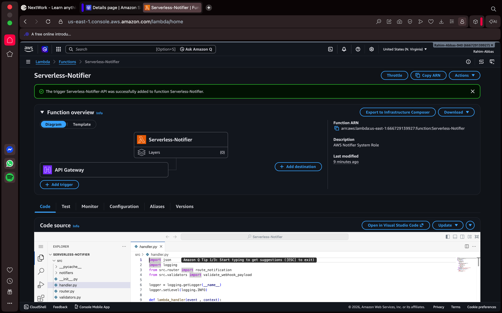
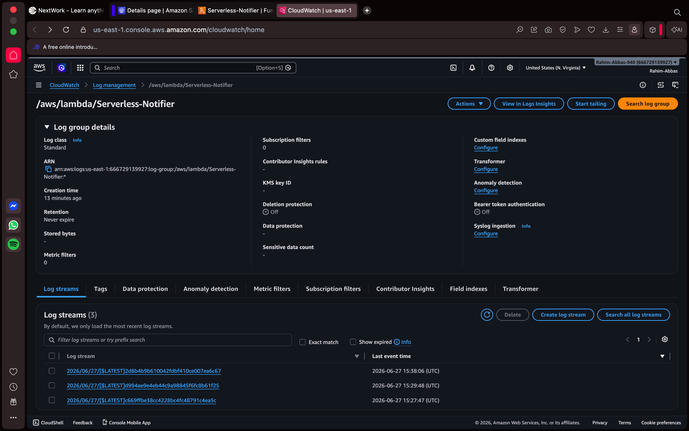
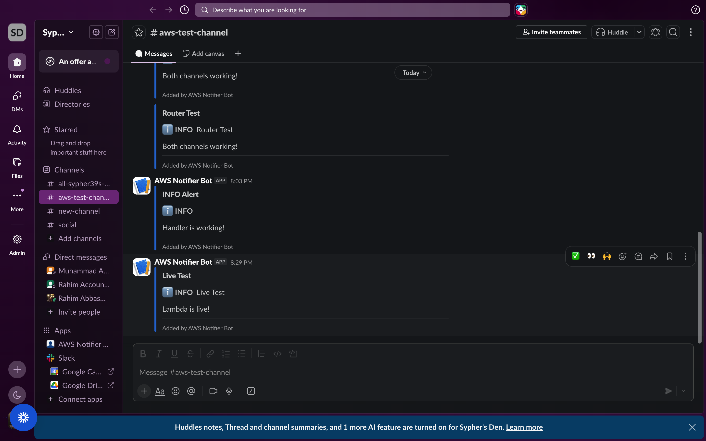

# Serverless Notification System

A production-ready serverless notification system built with Python and deployed on AWS Lambda. Sends alerts via **Email (AWS SES)** and **Slack** triggered by HTTP webhooks.

---

## Architecture

```
HTTP POST Request
      │
      ▼
 API Gateway
      │
      ▼
AWS Lambda (Python 3.12)
      │
      ├──── Validator ────► Reject bad payloads (400)
      │
      └──── Router
              │
              ├──── AWS SES ────► Email
              │
              └──── Slack Webhook ────► Slack Channel
```

---

## Features

- **Multi-channel notifications** — send to Email, Slack, or both simultaneously from a single request
- **Alert levels** — `info`, `warning`, `error`, `critical` with distinct colors and emojis per channel
- **Payload validation** — rejects malformed requests before touching any notification service
- **Per-channel fault isolation** — if one channel fails, others still fire
- **CloudWatch logging** — every invocation logged with payload and result
- **Styled HTML emails** — color-coded headers based on alert level
- **Slack Block Kit messages** — structured, readable alerts with emoji badges

---

## Tech Stack

| Layer | Technology |
|---|---|
| Runtime | Python 3.12 |
| Compute | AWS Lambda |
| Email | AWS SES (Simple Email Service) |
| Messaging | Slack Incoming Webhooks |
| HTTP trigger | AWS API Gateway (HTTP API) |
| Logging | AWS CloudWatch |

---

## Screenshots

### Lambda Function + API Gateway Trigger


### CloudWatch Logs


### Slack Notifications


---

## Project Structure

```
serverless-notifier/
├── src/
│   ├── __init__.py
│   ├── handler.py              # Lambda entry point
│   ├── validators.py           # Payload validation
│   ├── router.py               # Channel dispatcher
│   └── notifiers/
│       ├── __init__.py
│       ├── email_notifier.py   # AWS SES integration
│       └── slack_notifier.py   # Slack webhook integration
├── tests/
├── .env                        # Local environment variables (never commit)
├── .gitignore
└── README.md
```

---

## Prerequisites

- AWS account (free tier works)
- Python 3.12
- AWS CLI configured (`aws configure`)
- Slack workspace with Incoming Webhooks enabled
- Verified sender email in AWS SES

---

## Setup

### 1. Clone the repo

```bash
git clone https://github.com/yourusername/serverless-notifier.git
cd serverless-notifier
```

### 2. Install dependencies

```bash
pip install boto3 pytest pytest-mock
```

### 3. Configure environment variables

Create a `.env` file in the project root:

```bash
SES_SENDER_EMAIL=your-verified-email@gmail.com
SLACK_WEBHOOK_URL=https://hooks.slack.com/services/YOUR/WEBHOOK/URL
```

### 4. AWS SES Setup

1. Go to **AWS Console → SES → Verified Identities**
2. Create identity → Email address → enter your sender email
3. Click the verification link sent to that inbox
4. In sandbox mode, also verify any recipient emails the same way

### 5. Slack Webhook Setup

1. Go to [api.slack.com/apps](https://api.slack.com/apps) → Create New App → From scratch
2. Features → Incoming Webhooks → toggle On
3. Add New Webhook to Workspace → select a channel → Allow
4. Copy the webhook URL

### 6. IAM Role

Create a Lambda execution role with these permissions:

- `AWSLambdaBasicExecutionRole` (AWS managed policy)
- Inline policy for SES:

```json
{
  "Version": "2012-10-17",
  "Statement": [
    {
      "Effect": "Allow",
      "Action": [
        "ses:SendEmail",
        "ses:SendRawEmail"
      ],
      "Resource": "*"
    }
  ]
}
```

### 7. Deploy to Lambda

**Package the code:**

```bash
zip -r function.zip src/
```

**In AWS Lambda console:**

1. Create function → Author from scratch
2. Runtime: Python 3.12
3. Permissions: Use existing role → select your IAM role
4. Upload the `function.zip`
5. Set handler to `src.handler.lambda_handler`
6. Add environment variables:
   - `SES_SENDER_EMAIL`
   - `SLACK_WEBHOOK_URL`

### 8. Attach API Gateway

1. Lambda → Configuration → Triggers → Add trigger
2. Select API Gateway → Create new API → HTTP API
3. Security: Open → Add
4. Copy the generated endpoint URL

---

## API Reference

**Endpoint:** `POST https://<api-id>.execute-api.<region>.amazonaws.com/default/Serverless-Notifier`

**Headers:**
```
Content-Type: application/json
```

### Send to Slack

```bash
curl -X POST <your-endpoint> \
  -H "Content-Type: application/json" \
  -d '{
    "channel": "slack",
    "message": "Deployment to production completed.",
    "level": "info"
  }'
```

### Send to Email

```bash
curl -X POST <your-endpoint> \
  -H "Content-Type: application/json" \
  -d '{
    "channel": "email",
    "recipient": "someone@example.com",
    "subject": "High CPU Alert",
    "message": "CPU usage on prod-1 exceeded 90% for 5 minutes.",
    "level": "warning"
  }'
```

### Send to Both Channels

```bash
curl -X POST <your-endpoint> \
  -H "Content-Type: application/json" \
  -d '{
    "channel": ["email", "slack"],
    "recipient": "someone@example.com",
    "subject": "Critical: Database Unreachable",
    "message": "prod-db-01 has been unreachable for 3 minutes.",
    "level": "critical"
  }'
```

### Payload Schema

| Field | Type | Required | Description |
|---|---|---|---|
| `channel` | `string` or `array` | Yes | `"email"`, `"slack"`, or `["email", "slack"]` |
| `message` | `string` | Yes | Notification body text |
| `subject` | `string` | Email only | Email subject line and Slack header |
| `recipient` | `string` | Email only | Recipient email address |
| `level` | `string` | No | `info`, `warning`, `error`, `critical` (default: `info`) |

### Response

```json
{
  "status": "sent",
  "results": {
    "slack": { "success": true },
    "email": { "success": true, "message_id": "0100019f..." }
  }
}
```

### Error Response

```json
{
  "error": "Invalid payload",
  "details": [
    "'recipient' is required when channel includes 'email'",
    "'subject' is required when channel includes 'email'"
  ]
}
```

---

## Alert Levels

| Level | Email Header | Slack Emoji | Use Case |
|---|---|---|---|
| `info` | Blue | ℹ️ | Deployments, routine events |
| `warning` | Amber | ⚠️ | Elevated usage, approaching limits |
| `error` | Red | ❌ | Failures needing attention |
| `critical` | Dark Red | 🚨 | Outages, data loss risk |

---

## Local Testing

```bash
# Test validator
python -c "
from src.validators import validate_webhook_payload
print(validate_webhook_payload({'channel': 'slack', 'message': 'hello'}))
"

# Test Slack notifier
python -c "
import os
os.environ['SLACK_WEBHOOK_URL'] = 'your-webhook-url'
from src.notifiers.slack_notifier import send_slack
print(send_slack('Test message', level='warning', subject='Test'))
"

# Test full handler
python test_handler.py
```

---

## AWS Free Tier Limits

This project runs comfortably within AWS free tier:

| Service | Free Tier | Typical Usage |
|---|---|---|
| Lambda | 1M requests/month | Negligible for personal use |
| SES | 62,000 emails/month | Negligible for personal use |
| API Gateway | 1M requests/month | Negligible for personal use |
| CloudWatch | 5GB logs/month | Negligible for personal use |

**Idle cost: $0.00** — Lambda charges only on invocations, never for sitting idle.

---

## What I Learned

- How AWS Lambda handles HTTP events from API Gateway
- How to structure a Python project for serverless deployment
- AWS SES email verification and sandbox mode
- Slack Block Kit message formatting
- IAM roles and least-privilege permissions
- CloudWatch logging for serverless debugging
- Packaging Python code for Lambda deployment

---

## Author

**Rahim Abbas**  
Backend Engineer · AI Automation  
[GitHub](https://github.com/yourusername) · [LinkedIn](https://linkedin.com/in/yourprofile)